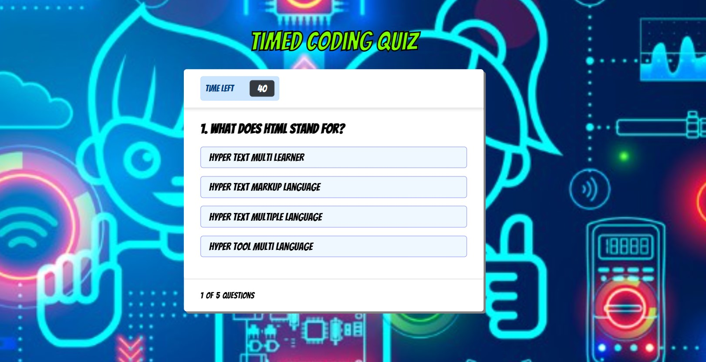

# Timed-Coding-Quiz

## Description
The Timed Coding Quiz is a fun web application game that helps users test their knowledge on coding. This timed game includes five questions and a score tracker at the end.

## Purpose
The Timed Coding Quiz application runs in a browser and features a fun quizzing game that allows the user to apply their knowledge of coding. The game provides five questions, which are timed and will deduct three seconds over all time if answered incorrectly. This engages the user to try their best and also gives them a chance to record their scores.

## Installation
To install my project use the following link: https://github.com/dianavw8/Timed-Coding-Quiz and follow these simple directions:

Above the list of files, click on the "Code" button.

Copy the URL for the repository.

Open Git Bash.

Change the current working directory to the location where you want the cloned directory.

Type git clone, and then paste the URL you copied earlier.

Press Enter to create your local clone.

For more help and information achiving this, check out the following website: https://docs.github.com/en/repositories/creating-and-managing-repositories/cloning-a-repository

## Usage
The refactored website can be found at: https://dianavw8.github.io/Timed-Coding-Quiz/

The following image demonstrates the web application's appearance and functionality:

## Lessons Learned
The Timed Coding Quiz was a challenging web application, because there were so many details to the game that needed to work perfectly together in order for the web application to function properly. Working on HTML, CSS and JS from scratch was a great challenge that required many hours, tweaks and online searching until I felt the game was complete. 

## Credits and Inspiration
https://github.com/dianavw8

https://coding-boot-camp.github.io/full-stack/github/professional-readme-guide

https://docs.github.com/en/repositories/creating-and-managing-repositories/cloning-a-repository